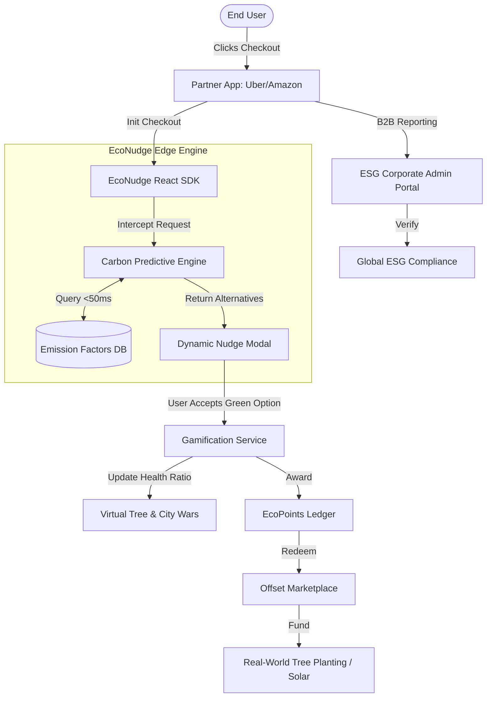

# EcoNudge SDK: Project Documentation

## 1. Problem Overview
Global climate change is accelerating, driven heavily by consumer micro-decisions. While many consumers possess a desire to reduce their carbon footprint, **friction kills adoption**. 

Currently, living sustainably requires users to download separate carbon-tracking applications, manually log their daily activities, and attempt to offset their emissions post-facto. This creates massive cognitive load. In the e-commerce, food delivery, and ride-sharing sectors, carbon emissions are hidden behind the convenience of a "Book Now" button.

**The core problem:** We don't need another standalone eco-app. We need an invisible sustainability layer integrated directly into the platforms where users already make high-carbon decisions.

## 2. Solution Approach & System Design
**EcoNudge SDK** solves this by intercepting decisions at the point of action. We built a drop-in React SDK that enterprise platforms (e.g., Uber, Zomato) can embed into their checkout flow. When a user clicks "Book", our proprietary engine calculates the carbon footprint in under 50ms and injects a real-time, gamified UI suggesting a greener alternative (e.g., "Take an auto instead. Save 192g of CO2").

### Architecture Diagram
Below is the system architecture demonstrating how the EcoNudge ecosystem operates seamlessly with sub-50ms latency:

## 3. Key Features

### A. Sub-50ms Predictive Carbon Engine
To ensure we do not harm our partner platforms' checkout conversion rates, our algorithm processes over 1,000+ data points (distance, packaging, vehicle type) in real-time. This Edge-based computation ensures the widget loads instantly without blocking the main UI thread.

### B. Gamification & Retention Loop
We transformed carbon tracking into a multiplayer game:
* **The Virtual Tree:** A Tamagotchi-style WebGL asset that thrives or withers based on your physical actions.
* **City Wars:** A global, low-latency leaderboard where cities compete in real-time to save the most carbon.

### C. Generative AI Reporting
Instead of static numbers, we built a personalized LLM hook. The on-board AI analyzes the user's specific micro-habits and types out a long-form, dynamic sustainability report directly into the dashboard.

### D. Corporate ESG Admin Portal
For enterprise partners, integrating EcoNudge provides verifiable, real-time Environmental, Social, and Governance (ESG) data. This allows corporations to instantly report their customer-driven carbon offsets to global regulators, making EcoNudge incredibly profitable for B2B integration.

### E. Developer API & Offset Marketplace
We give developers full headless API access to our carbon-calculation engine. Furthermore, users can spend their earned EcoPoints in our Offset Marketplace to fund actual, physical planetary healing, closing the digital-to-physical loop.
