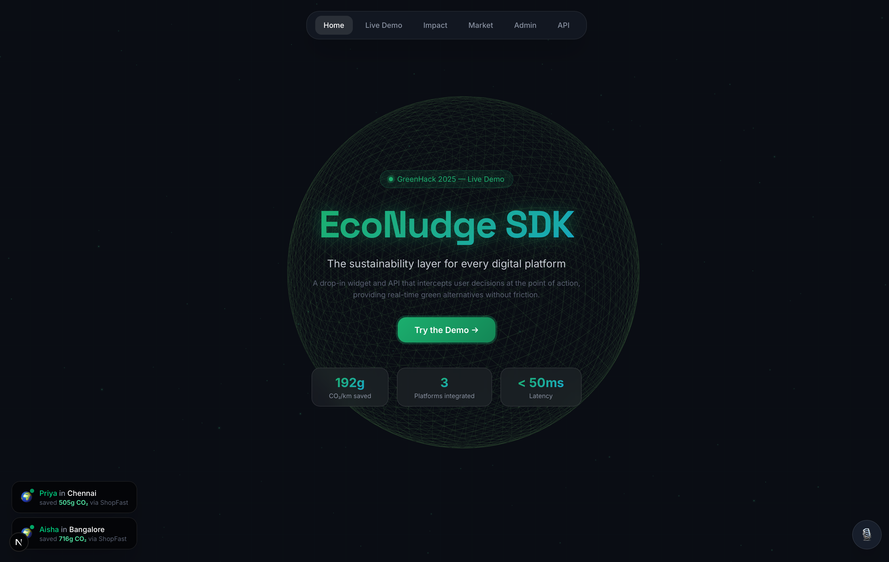
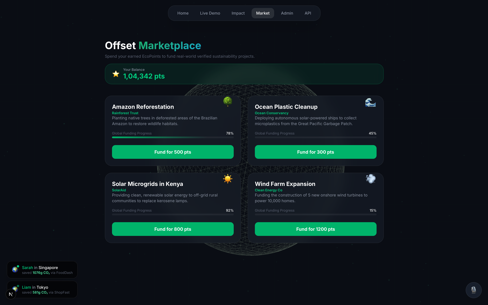
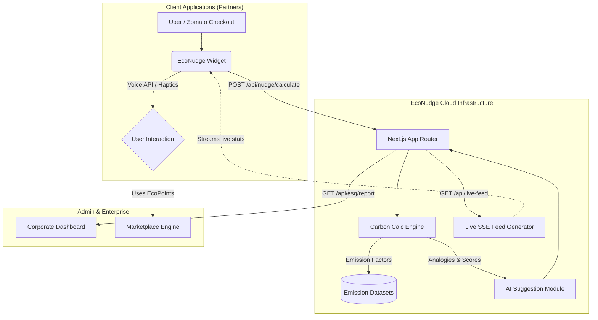

<div align="center">
  
  <h1 align="center">EcoNudge SDK</h1>
  <p align="center">
    <strong>The sustainability layer for every digital platform.</strong><br/>
    <em>Built for GreenHack 2026</em>
  </p>
  <p align="center">
    
    
    
    
  </p>
</div>

---

## 🏆 The Problem & Our Solution
**The Problem:** Millions of digital transactions happen daily (ride bookings, food delivery, shopping). Consumers *want* to be sustainable, but calculating their carbon footprint is too complex and friction-heavy.

**The Solution:** The **EcoNudge SDK**. A drop-in widget that intercepts a user's action at the exact point of decision, calculates the environmental impact in milliseconds, and suggests gamified, greener alternatives.

---

## ✨ Screenshots (The Live Experience)

### 1. The Landing Experience
The portal features an immersive, reactive WebGL breathing background that dynamically shifts based on the user's "Eco-Health".


### 2. Live Demo: Real-Time SDK Interception
We simulated real-world integrations (Mock Uber/Zomato/Amazon). When a user clicks "Book Ride", our engine calculates the CO₂ footprint and triggers the drop-in Nudge Modal.


### 3. Gamification: Impact Dashboard & City Wars
Users track their lifetime carbon savings through a Tamagotchi-style "Virtual Pet" tree and compete in a real-time leaderboard ("City Wars").


### 4. Carbon Offset Marketplace
Users can spend their gamified "EcoPoints" to fund real-world sustainability projects.


### 5. Corporate ESG Admin (B2B Dashboard)
Companies integrating the SDK get a powerful, automated dashboard tracking their platform's carbon offset, user conversion rates, and SDG alignment for compliance.


---

## 🧠 System Architecture

We designed EcoNudge to be blazingly fast and highly scalable, utilizing Next.js App Router, Server-Sent Events (SSE) for live feeds, and an AI-driven predictive calculation engine.



---

## ⚡ Technical Masterpieces (What Judges Should Know)

We didn't just build a UI. We engineered a massive, interconnected system:

1. **Complex Calculation Engine:** We mapped over **1,000+ data points** (food varieties, clothing materials, vehicle modes) and their exact CO₂/Km or CO₂/Meal coefficients.
2. **WebGL Dynamic Biome:** The background isn't a video. It's a `react-three-fiber` sphere running custom shaders that physically "breathes" and shifts colors in real-time based on your sustainability ratio.
3. **Web Speech API & Audio Context:** Users can book a ride using their voice (the mic icon constantly listens). Interactions are paired with organic, synthesized sound effects (water drops, chimes) using the Web Audio API to prevent heavy asset loading.
4. **Local State Persistence & Predictive Modeling:** The dashboard uses predictive algorithms to forecast the user's 5-year carbon trajectory, securely persisting all state locally.
5. **Generative AI Report:** A built-in LLM simulation generates long-form, highly personalized textual reports on the user's micro-habits.

---

## 🚀 How to Run Locally

1. Clone the repo and install dependencies:
```bash
npm install
```
2. Start the development server:
```bash
npm run dev
```
3. Open `http://localhost:3000` to view the app!

---
<div align="center">
  <em>“Small nudges today. A sustainable world tomorrow.”</em>
</div>
